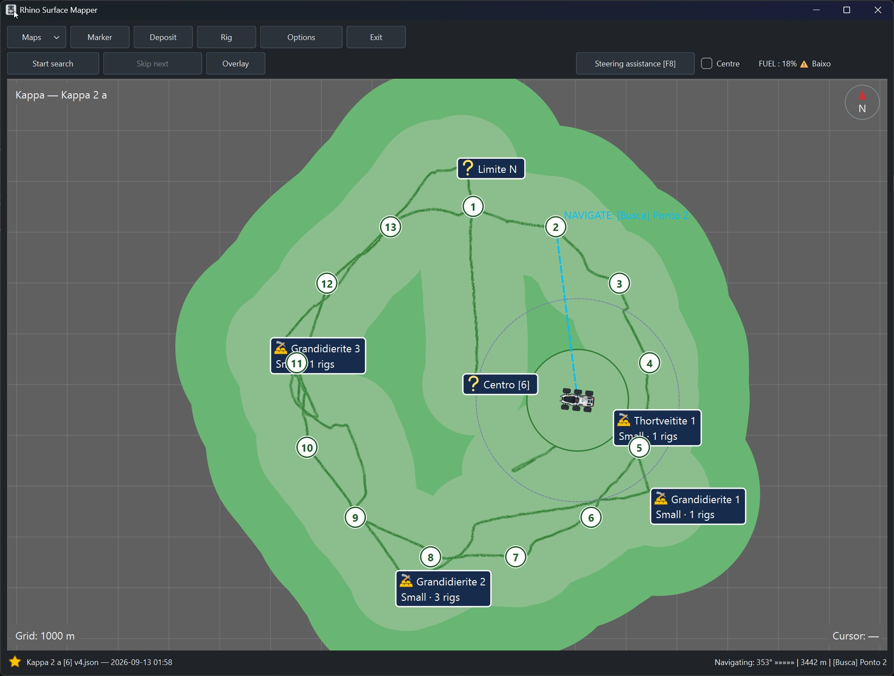
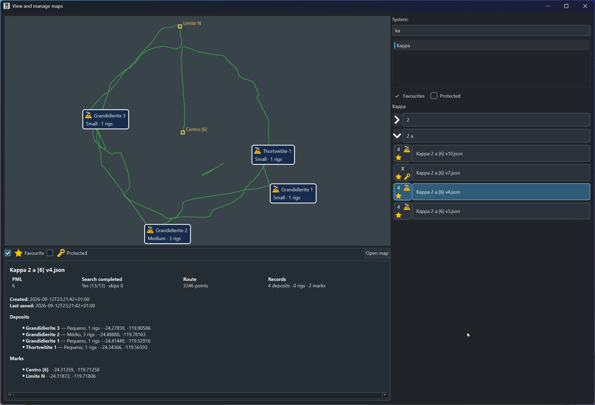
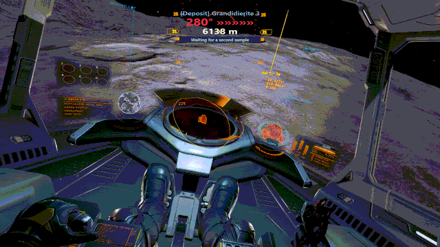

# Rhino Surface Mapper — Beta 1

Rhino Surface Mapper is an independent companion tool for *Elite Dangerous* Commanders, designed to help map Surface Mining activity, keep track of explored areas and recorded deposits, and navigate back to points of interest.

## Why Rhino Surface Mapper?

When Surface Mining and the Rhino arrived in *Elite Dangerous*, I found it difficult to search for deposits systematically: avoiding repeated coverage, knowing which areas I had already investigated, and remembering where I had found deposits of interest. What started as a simple application to solve that problem gradually gained additional functionality that I hope will be useful to other Commanders.

## Download Beta 1

Download the complete Beta 1 ZIP from [GitHub Releases](https://github.com/pbgaspar/rhino-surface-mapper/releases).

Beta 1 is for 64-bit Windows 10 and Windows 11. Extract the complete ZIP to a writable folder, keep the extracted folder together, and run `RhinoSurfaceMapper.exe`. Do not run the executable from inside the ZIP, and avoid protected locations such as `Program Files`.

This is a portable Beta. It stores `options.json` and the `MAPAS/` directory beside the executable.

## Features

- Live SRV position, heading, and fuel telemetry from *Elite Dangerous* `Status.json`.
- Surface mapping with route tracks and search routes.
- Planetary Mining Deposits, rigs, and named markers.
- Radar coverage and radar pulse visualisation.
- Saving and reopening maps as JSON files.
- Map Library for browsing saved maps.
- Favourite and protection functionality, including mining-only behaviour for protected maps.
- Navigation to map targets and a transparent navigation overlay.
- Optional steering assistance using game telemetry and configured input conditions.
- Configurable map, overlay, radar, and navigation settings.
- Windows, Dark, and Light interface themes.

The Map Library provides a view of saved maps and their recorded Planetary Mining Deposits, routes, rigs, and markers.

### Navigation overlay

The navigation overlay can display navigation information while *Elite Dangerous* is running. Optional steering assistance can use valid game telemetry and configured input conditions.

The application does not detect obstacles. Radar input observation does not prove that the game successfully fired a pulse.

## Language

The interface supports English and Portuguese (Portugal). Language changes apply after restarting the application.

## Planned features

**Powerplay Surface Mining assistance** — planned integration of the already developed market-data core to help Commanders earn Powerplay merits by identifying the three most relevant Surface Mining commodities in the current system, together with stations showing demand and market prices.

## Feedback and contributions

Please report reproducible bugs and suggestions through [GitHub Issues](https://github.com/pbgaspar/rhino-surface-mapper/issues).

Contributions, documentation improvements, and translation updates are welcome. See [`CONTRIBUTING.md`](CONTRIBUTING.md) for contribution guidance.

## Author

Rhino Surface Mapper was created and is maintained by **CMDR Paulo Gaspar**, with development assistance from ChatGPT and AI coding tools.

Developed as an independent companion tool for the *Elite Dangerous* community.

## Licence and third-party components

Rhino Surface Mapper is licensed under the [GNU GPL-3.0](LICENSE).

Runtime component notices are listed in [`THIRD_PARTY_NOTICES.txt`](THIRD_PARTY_NOTICES.txt), with corresponding source information in [`SOURCE_AVAILABILITY.txt`](SOURCE_AVAILABILITY.txt).

Rhino Surface Mapper is an independent project and is not affiliated with or endorsed by Frontier Developments. *Elite Dangerous* and related marks belong to Frontier Developments plc.
